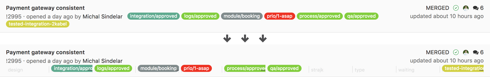

[Install (published from master branch)](https://chrome.google.com/webstore/detail/pogpjdbfdfnmlegpbhdmlebognmbamko)

[Install BETA (published from develop branch)](https://chrome.google.com/webstore/detail/efkcgkiajnleoaejcecljhnkdmeokiif)

---

## Version: 🐣 Pre-alpha 🐣

> Expect nothing and you will not be disappointed

---

## Features

#### General UI
* Always-expanded sidepanel

* Hide repo avatars `configurable`

* Disable label colors `configurable`

* Prefer Discussions over Comments

#### Merge Requests & Issues
* Categorize labels



* Enhance labels with date added


* Discussions sorted by newest first  

* Highlight new events since you last visit  


* `Q` keyboard shortcut to filter own issues/merge requests

* Keyboard shortcuts to toggle labels `configurable`


#### Merge Requests
* Hide footer with "You can merge this merge request manually using the command line" information

* Expand all diffs by default

* Appended custom links to Pipeline and Deploy sections

* **Squash** - checked by default `configurable`

* **Remove source branch** - checked by default `configurable`

## Enabling on your domain


<details><summary>Credits 🙏</summary>
  
Thx to [@bennokress](https://github.com/bennokress) for 
[requesting this feature](https://github.com/kiwicom/refined-gitlab/issues/55)
and [@niksy](https://github.com/niksy) for suggesting implementation
with [library](https://github.com/bfred-it/webext-domain-permission-toggle/)
from [@bfred-it](https://github.com/bfred-it)

</details>

## Future features
* [ ] Show usernames instead of real names

* [ ] Keyboard shortcut to "Assign to myself"

* <https://github.com/kiwicom/refined-gitlab/issues>

## Develop

```
npm run watch
```
